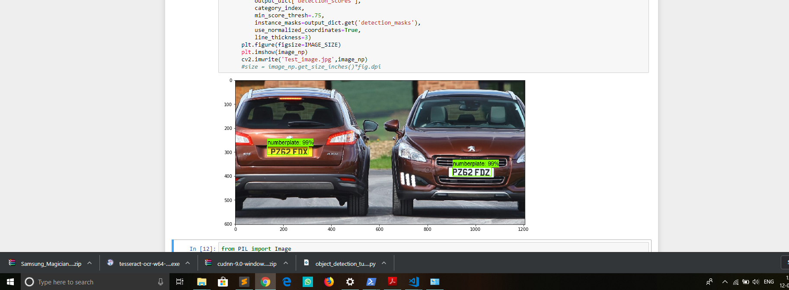
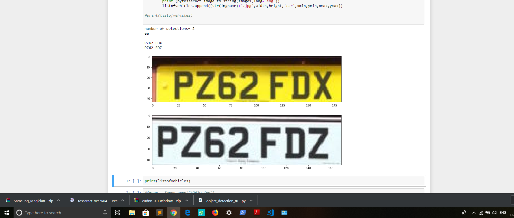

# Vehicle-Registration-number-detection
A Computer vision project which detects vehicle plate in an image and extracts the registration number made with help of TensorFlow Models

# Detection of Vehicle's license plate

# Conversion of image to text

